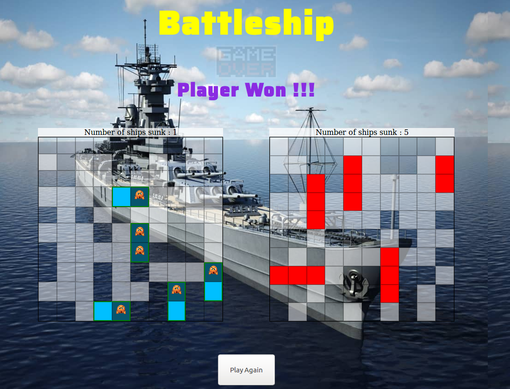

# battleship-game

Battleship is a strategy type guessing game for two players. It is played on ruled grids on which each player's fleet of ships (including battleships) are marked.

## How to play

[How to play the game](https://en.wikipedia.org/wiki/Battleship_(game))

## Live demo

[BattleShip Demo](https://rawcdn.githack.com/truetechcode/battleship-game/9768495e4e92db01a47aac64ca4ab17633435af0/dist/index.html)

## Contributors

- Louis SHEY _https://github.com/shloch_
- Terver Aosu _https://github.com/truetechcode_
