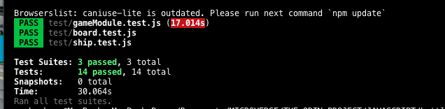

# battleship-game

Battleship is a strategy type guessing game for two players. It is played on ruled grids on which each player's fleet of ships (including battleships) are marked.

## How to play

[How to play the game](https://en.wikipedia.org/wiki/Battleship_(game))


## Live demo

[BattleShip Demo](https://rawcdn.githack.com/truetechcode/battleship-game/44f7347091a537f2348835d6531915b0d27a5319/dist/index.html)

## Getting Started

These instructions will get you a copy of the project up and running on your local machine for development and testing purposes. See deployment for notes on how to deploy the project on a live system.

### Prerequisites

This project is built with JavaScript and it depends on [Node.js & NPM](https://docs.npmjs.com/downloading-and-installing-node-js-and-npm) so you will need to make sure it is installed.
To verify you have successfully installed them run `node -v` to make sure node is installed. Example

```
$ node -v
v8.16.2
```

### Installing

A step by step series of examples that tell you how to get a development env running

Clone the project into your machine by running

```
$ git clone https://github.com/truetechcode/battleship-game
```

Install project dependencies by running

```
$ npm install
```

## Serve the project

Run the server with the following command:

```
$ npm start
```

## Running the tests

Run the test with the following command:

```
$ npm run test
```


## Deployment

### Deploy on Heroku

You can deploy the project on [Heroku](https://www.heroku.com/) using the following steps:

    1. Create a Heroku Account
    2. On the terminal, run `heroku create` to create a new app
    3. Run `heroku push` to start a deployment on Heroku.
    4. Visit your project URL as assigned by Heroku to see a live deployment.


## Contributors

### 👤 **SHEY Louis CHIA**

- Github: [shloch](https://github.com/shloch)
- Twitter: [@shloch](https://twitter.com/shloch)
- Linkedin: [/in/shey-louis-chia](https://www.linkedin.com/in/shey-louis-chia)
- Email: shloch2007@yahoo.fr


### 👤 **Terver Aosu**
- Github: _https://github.com/truetechcode_
- Twitter: [@truetechcode](https://twitter.com/truetechcode)
